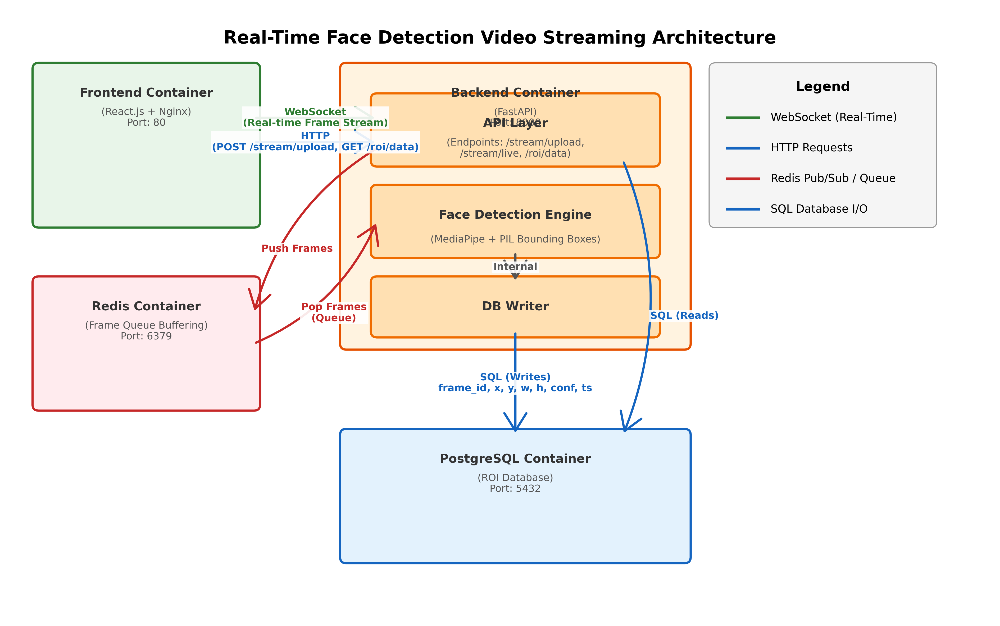

# 🚀 VisionPro: Real-Time Face Detection Streaming System


VisionPro is a production-grade, containerized application designed for high-performance face detection and ROI (Region of Interest) telemetry streaming. It leverages MediaPipe for real-time inference and Redis Pub/Sub for multicast video broadcasting, delivering a seamless 15fps experience directly to the browser.

## 🏗️ Architecture



The system follows a high-concurrency producer-consumer model. The **React Frontend** captures raw webcam frames and streams them via HTTP POST to the **FastAPI Backend**. These frames are queued in **Redis**, where a dedicated **MediaPipe Worker** performs inference, draws annotations using PIL, and persists ROI data to **PostgreSQL**. Processed frames are then broadcasted via **Redis Pub/Sub** to all connected WebSocket clients for real-time visualization.

## 📋 Prerequisites

Before you begin, ensure you have the following installed:
- **Docker 24.0+**
- **Docker Compose v2.20+**
- **Make** (standard on macOS/Linux)
- A working **Webcam**
- Ports **80** and **8000** must be available

## ⚡ Quick Start (5-Minute Setup)

Run the system in a single command:

```bash
# 1. Clone the repository
git clone https://github.com/nagachaitanya0004/real-time-face-detection.git
cd real-time-face-detection

# 2. Setup environment variables
cp .env.example .env

# 3. Build and launch the stack
make build
make up

# 4. Open the application
# URL: http://localhost
```

## ⚙️ Environment Variables

The system uses a centralized `.env` file in the root directory.

| Variable | Description | Required | Default |
| :--- | :--- | :--- | :--- |
| `POSTGRES_USER` | Database username | Yes | `postgres` |
| `POSTGRES_PASSWORD` | Database password | Yes | `securepassword` |
| `POSTGRES_DB` | Initial database name | Yes | `facedetection` |
| `DATABASE_URL` | SQLAlchemy/Asyncpg connection string | Yes | `postgresql://...` |
| `REDIS_URL` | Redis connection string | Yes | `redis://redis:6379/0` |
| `SECRET_KEY` | JWT/Session signing key | Yes | (Random string) |
| `CORS_ORIGINS` | Comma-separated list of allowed origins | No | `*` |

## 📡 API Reference

### 1. Upload Frame
`POST /api/stream/upload`
- **Request**: `multipart/form-data` (file: `JPEG`, session_id: `UUID`, frame_index: `INT`)
- **Response**: `{"frame_id": "uuid", "status": "queued"}`
- **Example**:
  ```bash
  curl -X POST -F "file=@frame.jpg" -F "session_id=..." -F "frame_index=0" http://localhost:8000/stream/upload
  ```

### 2. Live Stream (WebSocket)
`WS /ws/stream/live`
- **Description**: Connect to receive a real-time broadcast of annotated frames.
- **Payload**: Binary (JPEG bytes)
- **Example**: Connect using standard browser `WebSocket` API.

### 3. ROI Telemetry Data
`GET /api/roi/data`
- **Parameters**: `limit` (default 10), `offset` (default 0)
- **Response**: `[{"id": "...", "bbox_x": 100, "face_detected": true, ...}]`
- **Example**:
  ```bash
  curl http://localhost:8000/roi/data?limit=5
  ```

## 🛠️ Development Guide

### Running Backend Only
Useful for debugging API logic without Docker:
```bash
cd backend
pip install -r requirements.txt
uvicorn main:app --reload --port 8000
```

### Running Frontend Only
Vite HMR (Hot Module Replacement) enabled:
```bash
cd frontend
npm install
npm run dev
```

### Database Direct Access
```bash
docker exec -it face_detection_db psql -U postgres -d facedetection
```

## 🧪 Running Tests

The project includes a comprehensive suite using `pytest` and `httpx`.

```bash
# Run all tests via Docker
make test

# Local test execution
cd backend && pytest
```

- `tests/test_api.py`: Endpoint validation and payload limits.
- `tests/test_face_detector.py`: MediaPipe logic and OpenCV-free verification.
- `tests/test_database.py`: Parameterized query scans and SQL safety.

## 🤖 AI Collaboration Attestation

This project was built in collaboration with **Antigravity (AI)**.
- **AI Contributions**: Scaffolding of the multi-stage Dockerfiles, initial Pydantic models, Nginx proxy configuration, and the async Redis Pub/Sub architecture.
- **Human Validation**: Manual review of the MediaPipe worker lifecycle, SQL constraint design, and frontend canvas rendering performance. All security headers and CORS policies were manually audited.

## ⚠️ Known Limitations & Future Improvements

- **SSL/TLS**: Currently runs on HTTP. Production deployments should add an SSL certificate to the Nginx layer.
- **Horizontal Scaling**: The MediaPipe worker is a single instance; for high-scale, move to a distributed Celery/RabbitMQ task queue.
- **Session Auth**: Currently uses open session IDs; should be integrated with an Auth provider.

## 🔧 Troubleshooting

| Issue | Solution |
| :--- | :--- |
| **Port Conflict** | Ensure no other service is using port 80 or 8000. Run `lsof -i :80`. |
| **Camera Permission** | Browsers require `localhost` or `HTTPS` to access `getUserMedia`. Check browser site settings. |
| **DB Not Ready** | Backend uses `depends_on: service_healthy`. If DB fails to start, check Docker logs: `make logs`. |
| **WebSocket 403** | Ensure `CORS_ORIGINS` in `.env` includes your client's URL (default is `*` for dev). |
| **MediaPipe Download** | The first build may take longer as it downloads the face detection model weights. |

---
*Maintained by Vertex Platforms*
